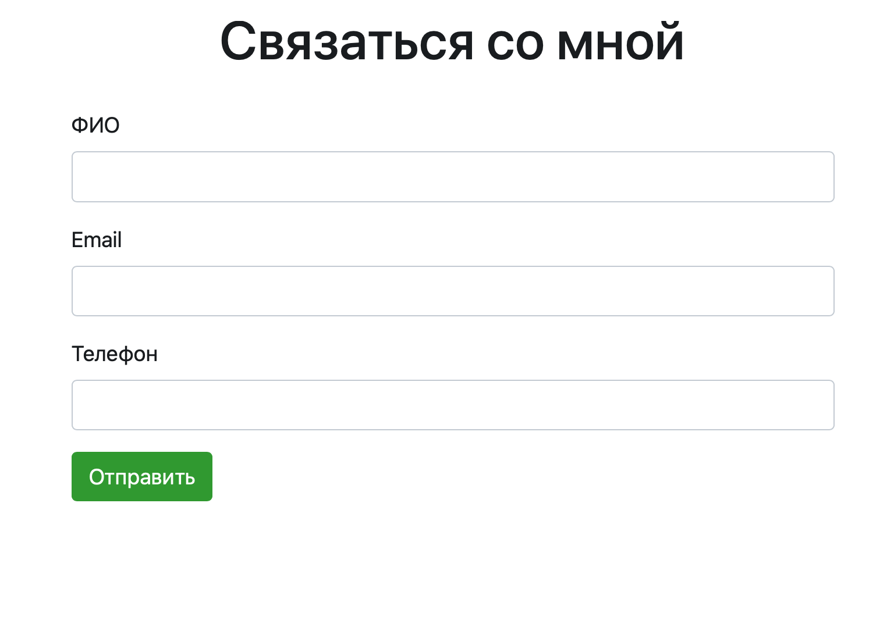

##  Страница обратной связи (feedback)

1. Установить и запустить [Docker](https://hub.docker.com)  

2. Клонировать проект из репозитория командой `git clone https://github.com/Maxmarok/feedback_test`, после перейти в директорию `feedback_test`  

3. Выполнить команды из списка по порядку (если нет [Make](https://makefiletutorial.com), переходим к 3.1):  
  - `make init` - собираем образ, запускаем среду, устанавливаем пакеты, миграции  
  - `make npm_install` - компилируем фронтенд часть  
  - `make test` - тестируем бэкенд часть (опционально)  
  - `make work` - включаем систему очереди, которая отправляет уведомления  

3.1 Если у вас нет [Make](https://makefiletutorial.com), можно развернуть проект вручную через докер:  
  - `cp .env.example .env` (`copy .env.example .env` для Windows) - копируем данные для подключения  
  - `docker-compose build app` - собираем образ  
  - `docker-compose up -d` - запускаем среду  
  - `docker-compose exec app composer install` - устанавливаем пакеты  
  - `docker-compose exec app php artisan key:generate` - генерируем ключ  
  - `docker-compose exec app php artisan migrate:fresh --seed` - запускаем миграции (убедитесь, что база пустая)  
  - `docker-compose exec app php artisan test` - прогоняем unit-тесты (опционально)  
  - `docker-compose run --rm npm install && docker-compose run --rm npm run prod` - компилируем фронтенд часть  
  - `docker-compose exec app php artisan queue:work` - включаем систему очереди, которая отправляет уведомления  

4. Открыть проект по ссылке в браузере `http://localhost:8000`  
  

4.1. На открытой странице ввести нужные данные и нажать кнопку "Отправить"  
  

4.2 Если данные валидны, то появится строчка "Данные успешно отправлены"  
  

5 Отправка уведомлений настраивается в .env файле:  
  • `ADMIN_EMAIL` – email, на который уходят сообщения (после установки нужно перезапустить `make seed`)  
  • `REPEAT_SENDING_TIME` – кол-во секунд для интервала между повторными отправками  
  • `DAILY_DELIVERY_MAX_COUNT` – лимит отправки повторных сообщений в день  
